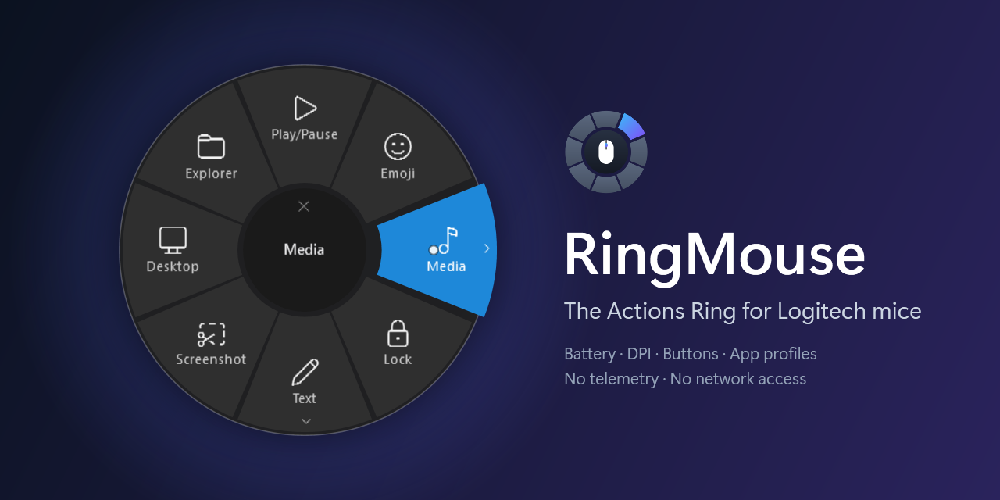
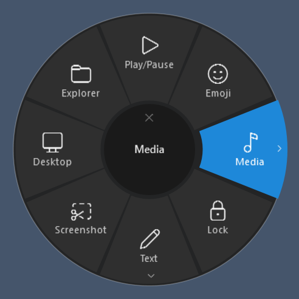
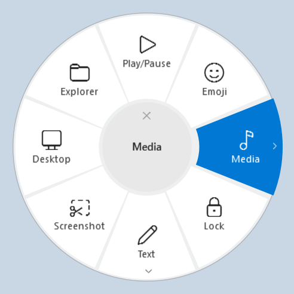
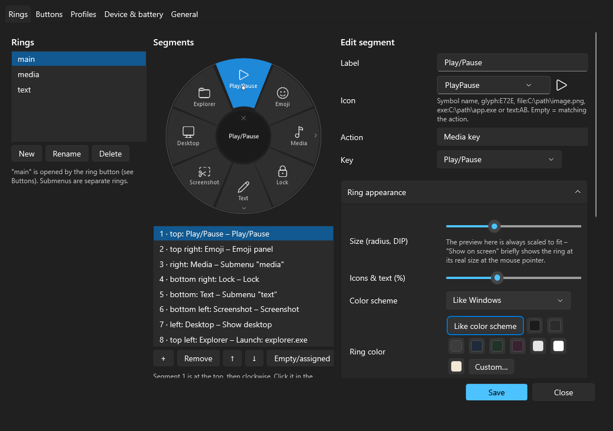
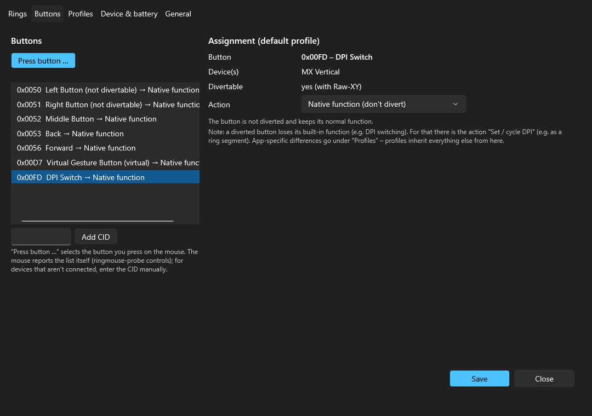
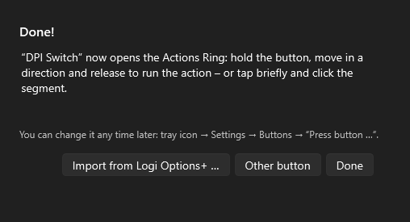
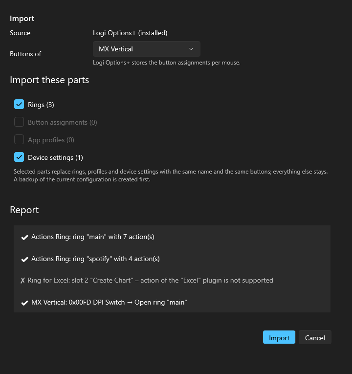

<p align="center">
  
</p>

The **Actions Ring** of Logi Options+ as a small standalone app for Windows 11 – plus the mouse functions that go with
it: the **battery level** in the tray with warnings, **DPI**, assignments for further buttons and **per-app profiles**
for Logitech mice. RingMouse covers only these mouse functions; everything else Options+ does (keyboards, webcams, Flow,
Smart Actions, lighting, firmware updates …) is not part of it. No driver, no admin rights, **no telemetry, no network
access**.

🇩🇪 [Deutsche Fassung](README.de.md)

- Talks HID++ 2.0 directly to the mouse (Bluetooth LE, USB cable, or a Bolt/Unifying receiver).
- Buttons are diverted via `REPROG_CONTROLS_V4` (0x1B04). The available buttons (CIDs) are always queried from the
  device – nothing is hard-coded.
- Diversions are re-applied after reconnects (0x1D4B), standby, unlocking, when the device reappears, and whenever the
  watchdog (every 30 s) finds a lost diversion.
- If signing out or shutting down is cancelled, RingMouse restarts itself after about 20 s.
- The configuration is a JSON file and is reloaded immediately when it changes.
- The user interface is available in English and German (follows the Windows display language, switchable).

**Supported mice:** Logitech mice with HID++ 2.0 – directly via Bluetooth, through a Bolt or Unifying receiver, or by
cable. Battery via `0x1004`, `0x1001` or `0x1000`, DPI via `0x2201` or `0x2202`. So far tested with the MX Vertical over
Bluetooth; other models should work – feedback is welcome (see [CONTRIBUTING.md](CONTRIBUTING.md)).

### Screenshots

**The ring** – follows the Windows theme; size, colors and opacity are adjustable:

<p>
  
  
</p>

**Settings** – edit rings with a live preview; choose a button simply by pressing it:




**First start** – press the button for the ring, or take over your setup from Logi Options+:

<p>
  
  
</p>

---

## Contents

1. [Installation](#installation)
2. [Switching from Logi Options+](#switching-from-logi-options)
3. [Using the ring](#using-the-ring)
4. [Configuration](#configuration) · [Action types](#action-types) · [Icons](#icons) · [Profiles](#profiles) · [Import & export](#import--export)
5. [Battery & tray](#battery--tray)
6. [Windows with admin rights (UIPI / uiAccess)](#windows-with-admin-rights-uipi--uiaccess)
7. [ringmouse-probe](#ringmouse-probe)
8. [Troubleshooting](#troubleshooting)
9. [Updates](#updates)
10. [Privacy](#privacy)
11. [Building from source](#building-from-source)
12. [License](#license)

---

## Installation

1. Download `RingMouse.exe` from the latest [release](https://github.com/Tim-Schaller/RingMouse/releases/latest).
   It is a single self-contained file – no .NET installation needed. The release also lists SHA-256 checksums.
2. Copy it to a permanent folder, e.g. `%LOCALAPPDATA%\Programs\RingMouse\`, and start it.
   The file is not code-signed, so Windows SmartScreen may warn on the first start (*More info* → *Run anyway*).
3. On the first start RingMouse creates `%APPDATA%\RingMouse\config.json` with a default ring: 8 slots plus the
   submenus *Media* and *Text*. As soon as your mouse is connected, the **first-run setup** asks for the ring button:
   simply press the button on your mouse that should open the ring (e.g. a thumb, gesture or DPI button). You can change
   it any time under Settings → *Buttons* → **Press button …**.
4. Tray icon → **Settings** → *General* → **Start with Windows** → Save.

RingMouse also adds itself to the **Start menu** (*RingMouse*), so you can always start it by hand – if it is already
running, this opens the settings. If you move the exe later, start it once from its new place: it repoints the Start
menu entry and the autostart by itself (a scheduled task needs one click on **Set up autostart now**, which asks via UAC).

Updating: quit RingMouse (tray → *Exit*, or `RingMouse.exe --exit`), replace the file, start it again.

## Switching from Logi Options+

Options+ and RingMouse compete for the same buttons. Options+ re-applies its diversions on every app switch and turns the
"analytics" reports for every click back on.

1. Take over your Options+ setup first: the first-run setup offers **Import from Logi Options+ …** (also under Settings →
   General). It brings over the Actions Ring with its folders, the button assignments and the app profiles – see
   [Import & export](#import--export).
1. Quit Options+: tray → Quit, then end `logioptionsplus_agent`, `logioptionsplus` and `LogiPluginService` in Task
   Manager.
2. Start RingMouse. The log (`%APPDATA%\RingMouse\logs\ringmouse-*.log`) should contain a line like
   `<mouse name> configured … diverted [0x…] Raw-XY [0x…]` with the CID of your ring button.
3. If everything works and you used Options+ only for this mouse: uninstall **Logi Options+**. Remove the **Logi Plugin
   Service** as well – it is the basis of the Options+ Actions Ring. If you still need Options+ for other devices (e.g. a
   keyboard or webcam), keep it – but let only one of the two programs handle the mouse; running both side by side is
   not tested.
4. If Options+ diverted buttons *persistently*, `ringmouse-probe controls` shows `PERSIST` for them. `ringmouse-probe
   reset` resets them. RingMouse also clears foreign diversions on unassigned buttons at startup by itself.

> A common reason why the Options+ ring only opens sometimes: app profiles in Options+ (e.g. for Edge, Teams or Office)
> assign the ring button differently there, e.g. to "change pointer speed". RingMouse profiles **inherit** from the
> default and only differ where you explicitly say so.

## Using the ring

| Mode (`ring.mode`) | Behavior |
|---|---|
| `hybrid` (default) | **Tap briefly**: the ring stays open, clicking a segment runs it. **Hold**: choose a direction, releasing runs it. |
| `hold` | Hold the button, choose a direction, release to run |
| `tap` | The ring stays open, a click runs the segment |

- Selection works **by angle**, not by hit-testing. Segment 1 is at the top, the others follow clockwise.
- **Submenus while holding (push-through):** hold the button and point towards a submenu – the segment is highlighted.
  Pushing further out (beyond about 85 % of the radius) opens the submenu while the button stays pressed. Releasing over
  the desired entry runs it. Disable with `ring.submenuPush: false`. Releasing on the submenu segment opens it for
  clicking as before.
- **Feedback:** the highlighted segment fades smoothly into the accent color and slides slightly outwards; while pushing
  through it moves further out. If the pointer stands still while holding (Raw-XY), a dot shows the movement and the
  normal mouse pointer is hidden meanwhile (`ring.hideCursor`; it comes back when the ring closes, in tap mode, after 5 s
  without movement, and after a crash on the next start). Submenus zoom in and back out, a segment flashes briefly when it
  runs and the ring fades out. Segment borders have 5° hysteresis so the highlight does not flicker. `ring.animation:
  false` turns the animations off.
- **Center (dead zone):** releasing or clicking there cancels. In a submenu the center means "Back".
- Other ways to cancel: **Esc**, **right-click**, clicking outside the ring, **pressing the button again** (tap mode).
  **Backspace** goes back one level.
- If the button supports **Raw-XY** (e.g. the DPI button of the MX Vertical; `ringmouse-probe controls` shows it per
  button), the pointer stands still while holding and the direction comes straight from the sensor. Otherwise the ring
  follows the pointer movement.
- Near the screen edge the ring is moved into the visible area; afterwards the pointer jumps back to where it was
  (`ring.restoreCursor`).
- The overlay never takes the focus, so the action lands in the window you were just using.
- Light/dark and the accent color follow Windows. The ring is per-monitor DPI aware.
- **Appearance** (Settings → Rings → "Ring appearance", with live preview):
  - Size (radius). "Show on screen" briefly shows the ring at its real size at the pointer, because the preview in the
    window is always scaled to fit.
  - Icons & text in %. Words that are too long get smaller automatically instead of being cut off.
  - Color scheme, ring color, highlight color and opacity. Text and shades are derived from the ring color.
  - Pointer dot: size and color.
  - Colors come from swatches or "Custom…" (Windows color dialog). In the config they are `"#RRGGBB"`; empty means
    automatic.
- **Latency:** each time the ring opens the log notes `Ring visible xx ms after button press`. Measured: about 24 ms from
  the HID event to the first frame.

## Configuration

**File:** `%APPDATA%\RingMouse\config.json`. Next to it, `config.schema.json` gives editors such as VS Code completion and
validation.
- Comments (`//`) and trailing commas are allowed.
- Changes take effect **immediately**.
- If the file has an error, the last valid configuration stays active and a tray message names the line.
- The settings window writes the same file. Saving from the window drops comments.

```jsonc
{
  "$schema": "./config.schema.json",
  "general": {
    "language": "auto",                 // auto | english | german
    "autostart": "run",                 // off | run | task
    "warnIfOptionsPlusRunning": true,
    "disableAnalyticsReporting": true,  // turn off the mouse's Options+ "click tracking"
    "logLevel": "Information"
  },
  "ring": {
    "mode": "hybrid", "radius": 150, "deadzone": 26, "tapThresholdMs": 350, "submenuPush": true, "hideCursor": true,
    "animation": true, "restoreCursor": true, "useRawXY": "auto", "rawXYScale": 0.6,
    "theme": "system", "showLabels": true, "autoCloseSeconds": 8,
    "ringColor": null, "accentColor": null, "opacity": 100, "textScale": 100,   // null = automatic, otherwise "#RRGGBB"
    "pointerColor": null, "pointerSize": 9
  },
  "buttons": {                          // CID → action (CIDs: Settings → Buttons, or ringmouse-probe controls)
    "0x00FD": { "type": "ring", "ring": "main" }   // created by the first-run setup for the button you pressed
  },
  "rings": {
    "main": { "segments": [
      { "label": "Play/Pause",  "icon": "PlayPause",  "action": { "type": "media", "key": "playPause" } },
      { "label": "Emoji",       "icon": "Emoji",      "action": { "type": "system", "command": "emojiPanel" } },
      { "label": "Media",       "icon": "Music",      "action": { "type": "submenu", "ring": "media" } },
      { "label": "Lock",        "icon": "Lock",       "action": { "type": "system", "command": "lock" } },
      { "label": "Text",        "icon": "Edit",       "action": { "type": "submenu", "ring": "text" } },
      { "label": "Screenshot",  "icon": "Screenshot", "action": { "type": "screenshot" } },
      null,                                         // empty slot
      { "label": "Explorer",    "icon": "Folder",     "action": { "type": "launch", "target": "explorer.exe" } }
    ] },
    "text": { "title": "Text", "segments": [
      { "label": "Done",    "icon": "Check", "action": { "type": "snippet", "text": "Done {now:yyyy-MM-dd HH:mm}" } },
      { "label": "Regards", "icon": "Mail",  "action": { "type": "snippet", "text": "Best regards{newline}{user}" } }
    ] }
  },
  "profiles": [
    { "name": "Excel", "processes": ["excel.exe"],
      "buttons": { "0x0053": { "type": "keys", "keys": "Ctrl+Z" } },   // Back = Undo, only in Excel
      "rings":   { "main": "main-excel" } }                           // a separate ring in Excel
  ],
  "devices": {
    "*":           { },
    "MX Vertical": { "dpi": 1000 }      // re-applied after every reconnect
  },
  "battery": { "thresholds": [20, 10, 5], "notifyCharged": true, "pollMinutes": 10, "trayDevice": null },
  "debug": { "rawHidLog": false, "logRingLatency": true }
}
```

### Action types

| `type` | Fields | Notes |
|---|---|---|
| `ring` | `ring` | only as a button assignment: opens a ring |
| `submenu` | `ring` | only inside a ring: submenu in the same place |
| `keys` | `keys` | `Ctrl+Shift+S`, `Win+.`, `Alt+F4`, sequence `Ctrl+K, Ctrl+C`. German key names are accepted too (Strg, Entf, Pos1 …); character keys follow the active keyboard layout |
| `media` | `key` | `playPause`, `next`, `previous`, `stop`, `volumeUp`, `volumeDown`, `mute` |
| `launch` | `target`, `arguments`, `workingDirectory`, `elevated` | path, file, folder, URL, URI (`ms-settings:`, `spotify:…`), `shell:AppsFolder\<AUMID>` |
| `snippet` | `text`, `mode` (`type`/`paste`) | placeholders `{now:yyyy-MM-dd HH:mm}`, `{date}`, `{time}`, `{clipboard}`, `{user}`, `{computer}`, `{newline}` |
| `powershell` | `script` **or** `command`, `arguments`, `hidden`, `usePwsh`, `elevated` | commands run via `-EncodedCommand` (no quoting problems) |
| `screenshot` | – | Snipping Tool selection (`ms-screenclip:`), fallback Win+Shift+S |
| `system` | `command` | `lock` (LockWorkStation – Win+L cannot be sent via SendInput), `emojiPanel`, `showDesktop`, `taskView`, `clipboardHistory`, `monitorOff`, `openSettings` |
| `dpi` | `values` | one value = set, several = cycle, e.g. `[1000, 2000]`. Replaces the DPI function of a diverted DPI button |
| `appKeys` | `process`, `keys`, `restoreFocus`, `launchIfNotRunning` | hotkey for a specific app: briefly activate its window, send, return the focus |
| `mouse` | `button` | `left`, `right`, `middle`, `back`, `forward`. As a button assignment the button is held down like the physical one |
| `sequence` | `steps` | several actions, with `{ "type": "delay", "ms": 300 }` in between |
| `native` | – | native function (do not divert the button) |
| `none` | – | disable the button |

**Launching without admin rights:** if RingMouse itself runs elevated, it still launches programs through the Explorer
shell without admin rights – unless `"elevated": true` is set.

**Spotify without the Web API:** Options+ controls Spotify through the Web API (internet and login). With `appKeys` it
works locally: desktop hotkeys sent to the Spotify window, e.g. `Ctrl+S` shuffle, `Ctrl+R` repeat, `Alt+Shift+B` like. A
playlist opens via `launch` with its `spotify:playlist:…` URI; you start playback yourself.

### Icons

- **Symbol names** (Segoe Fluent Icons): `PlayPause Pause Stop Next Previous Volume VolumeUp VolumeDown Mute Emoji Music Album Lock Ticket Tag Screenshot Camera Photo Folder FolderOpen Explorer Shuffle Repeat RepeatOne Heart HeartFill Playlist List Clock Recent Timer Check CheckMark Save Refresh Sync Back Forward Cancel Settings Globe Web Terminal PowerShell Keyboard Mouse Mail Copy Paste Cut Undo Redo Search Calendar Star Link Edit Delete Add Phone People Microphone Video Monitor Desktop TaskView Power Brightness Home Pin Flag Warning Info Code Dpi Speed Headphones Chat Print Share Download Upload Cloud Bluetooth Battery Help Zoom FullScreen Clipboard Laptop Shield Document ChevronRight`
- **Custom icons:**
  - `glyph:E72E` for any code point
  - `file:C:\path\image.png` for a PNG, ICO or JPG file
  - `exe:C:\path\app.exe` for the program icon
  - `text:AB` for up to 3 characters
- **Without an icon:** RingMouse picks one that matches the action. For `launch` it is the program's icon.

### Profiles

- The **first** matching profile wins. What counts is the process name of the foreground window, e.g. `excel.exe`; the
  wildcards `*` and `?` are allowed.
- A profile only overrides what it contains: single `buttons` and/or `rings` (ring name → another ring).
- Everything else comes from the default.
- Buttons that are only assigned in a profile are still diverted everywhere. In other apps RingMouse emulates their
  native function (back/forward/middle).

### Import & export

- **Export:** Settings → General → *Export …* saves the configuration as a `.json` file, e.g. for another computer.
- **Import:** *Import …* accepts such a file or an Actions Ring preset exported from Logi Options+ (`.lp5`). A preview
  lists what will be taken over and what not; you choose the parts: rings, button assignments, app profiles, device
  settings and – for RingMouse files – general settings. Selected parts replace rings, profiles and device entries with
  the same name and the same buttons; everything else stays. A backup of the current configuration is created first.
- **From Logi Options+:** *Import from Logi Options+ …* (also offered by the first-run setup) reads the local Options+
  data: the Actions Ring with its folders (from the Logi Plugin Service, including per-app rings) and the button
  assignments and app profiles of the mouse you choose (from the Options+ settings database, read from a copy).
  - Taken over: keyboard shortcuts, text snippets, program/file/URL launches, media and Windows functions, macros made of
    these, and the Spotify plugin actions (as local Spotify hotkeys; playlists via their `spotify:` URI).
  - Not transferable: actions of other plugins (e.g. Excel, Teams, Photoshop), dial adjustments, gestures, Easy-Switch,
    macOS shortcuts and "change pointer speed". The report names each one.
  - Only profiles and applications are read – no account, analytics or other Options+ data.
- `RingMouse.exe --import-report <file>` writes what an import from the installed Options+ would produce, without
  changing anything – handy for bug reports.

## Battery & tray

- **Tray icon:** the battery level as a number inside a ring. The ring identifies RingMouse (to tell it apart from other
  percentage icons, e.g. MagicPods) and shows the level as an arc starting at 12 o'clock.
  - white or black to match the taskbar, orange below 20 %, red below 10 %
  - green while charging or on cable, a check mark at 100 %
  - gray if the mouse cannot be reached (last known level)
  - "?" without a value
- **Tooltip:** e.g. `MX Vertical: 64 % · discharging · Bluetooth LE`. While the mouse sleeps it shows the last known level
  with its time.
- **Warnings** at 20, 10 and 5 %: each threshold once per discharge cycle. It re-arms when charging or when the level
  rises 5 points above it. Plus "charging complete". On Windows 11 they appear as normal notifications.
- **Source:** `0x1004 UNIFIED_BATTERY`, otherwise `0x1001 BATTERY_VOLTAGE` with a Li-ion curve that can be adjusted via
  `battery.voltageCurve`, otherwise `0x1000`. The MX Vertical reports level steps via `0x1000`.
- **Updates:** via events from the mouse plus a query every `pollMinutes`. The last level is kept in
  `%APPDATA%\RingMouse\state.json`.

## Windows with admin rights (UIPI / uiAccess)

Windows does not let a normal process send input to windows with higher rights (UIPI), and low-level hooks do not see
clicks there either. RingMouse **detects and logs** this and shows a message once per program. The ring still opens, but
only works in hold mode in that case.

| Setup | Solution |
|---|---|
| Your account is an administrator (UAC with "Yes") | Autostart "**scheduled task with highest privileges**" in the settings. The task runs with normal priority and without a time limit. |
| **Standard user + separate admin account** | "Highest privileges" does not help, because admin windows run under the other account. The solution is the **uiAccess installation**. |

**uiAccess installation:** the exe is signed and placed in `C:\Program Files\RingMouse`. It then runs without admin
rights but may still operate admin windows. Use `RingMouse-uiAccess.zip` from the release (or build it yourself with
`.\build.ps1 -Target Publish`), then run as administrator:

```powershell
Start-Process powershell -Verb RunAs -ArgumentList '-ExecutionPolicy Bypass -File "<path>\tools\install-uiaccess.ps1"'
```

The script creates a local code-signing certificate that cannot be exported and is only trusted on this computer.
Alternatively pass one from your own PKI with `-Thumbprint`. It then copies and signs the app. Afterwards start RingMouse
from `C:\Program Files\RingMouse` and enable *Start with Windows*. Settings → General → Info then shows "uiAccess yes".

## ringmouse-probe

A console diagnostic tool. It needs no admin rights and only reads, except for `live` and `reset`.

```text
ringmouse-probe list                     all Logitech HID collections: usage page/usage, report IDs, HID++, BLE/USB/receiver
ringmouse-probe info | features | controls | battery | dpi [--set N] | dump
ringmouse-probe live --cid 0x00FD [--rawxy] | --all     divert a button, show raw + decoded events (Ctrl+C restores)
ringmouse-probe monitor                  listen only (also shows other software such as Options+)
ringmouse-probe watch [--cid 0x00FD] [--takeover]       DeviceService as in the app: reconnect/standby/watchdog live
ringmouse-probe reset [--cid ..]         diversions/remaps/analytics back to native
Options: --device <n|PID>  --index <1-6>  --swid <1-15>  --raw  --record frames.jsonl  --duration <s>  --timeout <ms>
```

Example – findings for an MX Vertical over Bluetooth:
- Connected via **BLE**, PID `B020`, HID++ 4.5.
- The HID++ collection is `COL02` with **usage page 0xFF43 / usage 0x0202**. Over BLE there are only long reports
  `0x11`, not `0xFF00`.
- Buttons: `0x0050` and `0x0051` cannot be diverted. `0x0052`, `0x0053`, `0x0056` and `0x00FD` (DPI switch) can, each
  with Raw-XY. `0x00D7` is a virtual button.
- Battery via `0x1000`, DPI 400–4000 in steps of 100.

## Troubleshooting

| Problem | Cause / solution |
|---|---|
| The ring does not open | Is a ring button assigned (Settings → Buttons)? Is Options+ running? See the tray tooltip or the log: look for `diverted [0x…]` with the button's CID. Cross-check with `ringmouse-probe live --cid <CID>` |
| A button does nothing after a crash | The temporary diversion is still active. Switch the mouse off and on, or run `ringmouse-probe reset`. Restarting RingMouse sets it again as well |
| After waking up, the first press takes a moment | BLE reconnects. RingMouse configures the mouse after `0x1D4B`, after standby ends (+2/+6/+15 s) and via the watchdog |
| Battery shows "?" or gray | The mouse sleeps and has not reported a value yet. The tooltip shows the last level |
| An action does not reach an admin window | UIPI, see [uiAccess](#windows-with-admin-rights-uipi--uiaccess) |
| A text snippet arrives garbled in RDP/Citrix | Use `"mode": "paste"` |
| App hotkeys (`appKeys`) have no effect | The app must run with a window. If it is only minimized to the tray, it is opened briefly. Spotify hotkeys cannot be made global |
| `config.json` is broken | The previous configuration stays active. The tray message names the line; with `config.schema.json` your editor shows the error |
| Autostart "task" does not help | The higher rights only apply to admin accounts, see above. The task also starts RingMouse on **unlock** if it is not running (tasks created by older versions: set them again once in the settings – UAC asks for an admin account). The Run entry only starts at sign-in |
| The ring stops reacting after standby/Bluetooth dropouts | A separate watchdog thread detects a stuck device service after 45 s, cancels the step and restarts it if needed. The log then shows `Device management stuck for … s at "<step>"`, every 10 min a line about missing Logitech devices and every 30 min a status line |
| RingMouse does not respond (Windows says "not responding") | The UI watchdog writes `UI thread not responding for … (step: …)` to the log – please report that line |

## Updates

From v1.1.3 on, RingMouse keeps itself up to date. A few minutes after start, and then every 12 hours, it checks
GitHub for a new release; if there is one it downloads it and installs it once the PC has been idle for a while. You
control the details under **Settings → General → Updates**:

- **Check for updates and install them automatically** – turn automatic updates off here. Even with it off, RingMouse
  still tells you when a new version is available; you then install it with **Update now**.
- **Install after idle (min)** – how many minutes the PC must be unused before a downloaded update is installed, so an
  update never interrupts you.
- **Check now / Update now** – check or install on demand, and see the current status.

How it stays safe:

- Each release carries a `latest.json` that is **signed with a private key only the maintainer holds**. RingMouse
  installs an update only if the signature matches its built-in public key *and* the version is newer. Taking over the
  download source or the GitHub account is therefore not enough to push foreign code, and an equal or older version is
  never installed.
- The downloaded file is verified against the size and SHA-256 from the manifest before it is used.
- The update check is the **only** network connection RingMouse makes (see [Privacy](#privacy) and
  [SECURITY.md](SECURITY.md)).

The standard `RingMouse.exe` replaces itself: it renames the running file to `.old`, puts the new one in its place and
restarts. The **uiAccess variant is not updated automatically** – it lives in `C:\Program Files` and is locally
signed, so RingMouse only notifies you there; update it by hand and re-run `tools\install-uiaccess.ps1`.

## Privacy

RingMouse has no telemetry. Its only network connection is the update check on GitHub (signed releases; can be
turned off under Settings → General). Everything else stays on your computer:
- `%APPDATA%\RingMouse\` – `config.json`, `config.schema.json`, `state.json` (last battery levels), `logs\`
- `%LOCALAPPDATA%\RingMouse\startup.log` – a small start-up trace

Logs and `ringmouse-probe dump` recordings contain technical device data such as the unit ID of your mouse. Check them
before you share them in a bug report.

For the security model (the configuration is executable, the uiAccess residual risk, release integrity) and how to
report a vulnerability, see [SECURITY.md](SECURITY.md).

## Building from source

```powershell
.\build.ps1                       # build + tests + publish (needs the .NET 10 SDK)
# Result:
#   publish\RingMouse\RingMouse.exe          – the app (single file, self-contained)
#   publish\probe\ringmouse-probe.exe        – diagnostic tool
#   publish\RingMouse-uiAccess\              – variant for admin windows (see above)
```

```
src/RingMouse.HidPlusPlus   HID++ protocol (framing, matching, features 0x0000/0001/0003/0005/1000/1001/1004/1B04/1D4B/2201/2202,
                            receiver registers) + a lean Win32 HID transport (hid.dll/cfgmgr32, overlapped I/O). No packages.
src/RingMouse.Core          configuration (model, JSON, schema, validation, hot reload), ring geometry + state machine,
                            profiles, battery thresholds, keyboard shortcut parser, text snippets, localization
src/RingMouse.Platform      Win32: SendInput, low-level hooks, foreground/elevation, launching without admin rights,
                            clipboard, autostart (Run/task), monitors/DPI, theme
src/RingMouse.Device        DeviceService: discovery, life cycle, diversion, button detection, watchdog, battery, DPI, receivers
src/RingMouse.Actions       action engine (own STA thread)
src/RingMouse.App           WPF tray app: ring overlay, tray, settings, first-run setup, logging (Serilog)
tools/RingMouse.Probe       ringmouse-probe
tests/…                     unit tests: protocol (incl. replayed real MX Vertical frames), core, DeviceService simulator
```

- `.\build.ps1 [-Target Build|Test|Publish|All]`
- .NET 10 (LTS until 11/2028), self-contained, win-x64. The SDK's CLI telemetry is turned off in the script.
- `RingMouse.exe --exit` quits a running instance cleanly (like tray → Exit; diversions are reset), e.g. before an update.
  Exit code 0 = quit or was not running.
- `RingMouse.exe --render-ui <folder>` renders the ring, tray icons and settings pages as PNG files, without a mouse –
  in English and German, plus the logo and the app icon (`ringmouse.ico`). The pictures in `docs/images` come from it.
- `RingMouse.exe --selftest --quiet` checks the real path: device configured, ring visible, focus kept, clean exit. The
  result is in the log. Actions only run as a dry run (nothing is executed); don't move the mouse meanwhile.
- Manual test checklist for contributors: [docs/testing.md](docs/testing.md).
- Dependencies: Serilog (Apache-2.0), H.NotifyIcon (MIT), xUnit (Apache-2.0). Solaar was used as a protocol reference
  only; no GPL code was copied.

## License

[MIT with "Commons Clause"](LICENSE): RingMouse may be used free of charge – also at work –, modified and passed on free
of charge. Selling RingMouse, or offering paid products or services whose value derives substantially from it, is not
permitted. For contributions see [CONTRIBUTING.md](CONTRIBUTING.md).

Logitech, Logi Options+ and MX Vertical are trademarks of Logitech. RingMouse is an independent project and is not
affiliated with Logitech.
